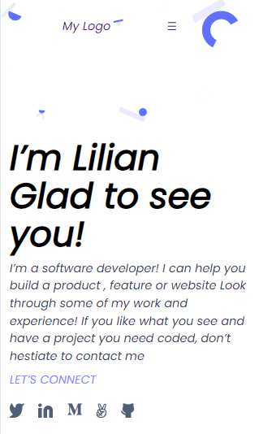

# My Portfolio

> This is a mobile version portfolio project by microverse to test the use of Flexbox for Positioning and also grids, images and Background, 

## Built With

- Html
- CSS
- JS

## Live Demo
- [Live Demo Link](http://www.lilianfrancis.com)

## Getting Started

To get a local copy up and running follow these simple example steps

### Prerequisites
Github Account 

### Setup
Set up and configure git on your system.

### Install
Clone this repository

## Authors

👤 **Author1**

- GitHub: [@ifnotlily](https://github.com/ifnotlily)
- Twitter: [@ifnotlily](https://twitter.com/ifnotlily)
- LinkedIn: [lilian-francis](https://linkedin.com/in/lilian-francis)

## 🤝 Contributing

Contributions, issues, and feature requests are welcome!

Feel free to check the [issues page](../../issues/).

## Show your support

Give a ⭐️ if you like this project!

## Acknowledgments

- Hat tip to anyone whose code was used
- Inspiration
- etc

## 📝 License

This project is [MIT](./MIT.md) licensed.
